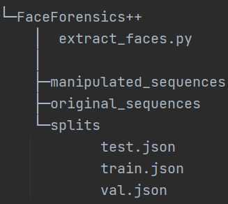
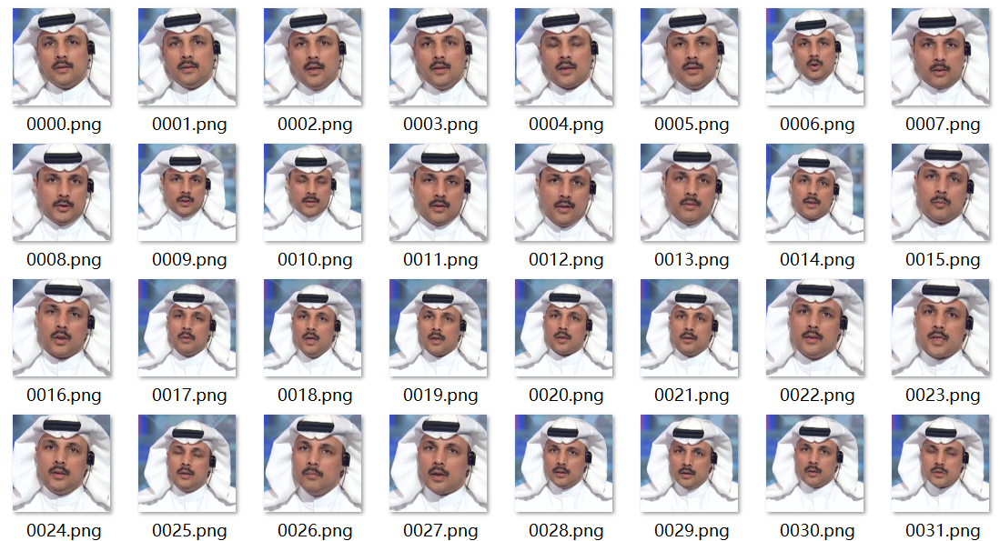
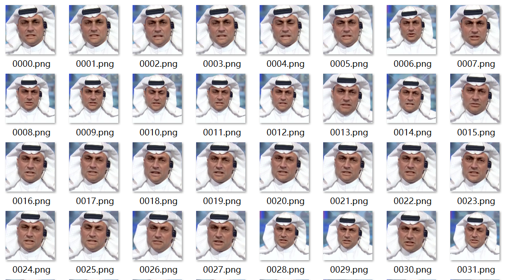
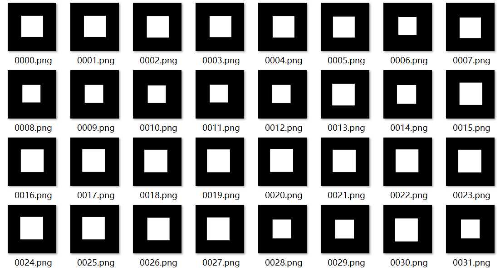

# Face-X-Ray

An unofficial implementation of Lingzhi Li, Jianmin Bao, Ting Zhang, Hao Yang, Dong Chen, Fang Wen, Baining Guo: Face X-Ray for More General Face Forgery Detection. CVPR 2020.

## Dependancies

install dependancies:

```shell
pip install -r requirements.txt
```

## Usage

### Data Pre-processing

You can extract raw faces, manipulated faces, manipulation mask and face landmarks (saved as `.npy` file) of FaceForensics++ dataset by:

```shell
python extract_faces.py -d ./dataset/FaceForensics++ -o ./dataset/FaceForensics++/extract -c raw
```

Notice the dataset directory should be organized as follows:



And the directory "manipulated_sequences" and "original_sequences" are organized as the default structure of FaceForensics++ download script.

#### Some examples of run results

Extracted real faces:



Extracted manipulated faces of Deepfakes:



Extracted manipulation mask of Deepfakes:



### Train

You can train the model by running:

```shell
python train.py -c ./experiments/default.yaml --hrnet_model ./HRNet/pretrained/hrnetv2_pretrained.pth
```

Experiment configuration can be modified in `./experiments/default.yaml`

The HRNet model is borrowed from [HRNet official repository](https://github.com/HRNet/HRNet-Image-Classification).

The blended image in the paper is generated online during training(`dataset.py`), generation code is borrowed from [the author's repository](https://github.com/AlgoHunt/Face-Xray).

### Evaluate

You can evaluate the trained model by running:

```shell
python evaluate.py --ckpt_dir ./result/xxx -d Deepfakes -c raw -r ./dataset/FaceForensics++ -o ./log
```

### Detect A Video

You can use the trained model to detect a video by running:

```shell
python detect_video.py --ckpt_dir ./result/result_xxxx -v myVideo.mp4 -o ./detect_result
```

The detect script is borrowed from [FaceForensics++ official repository](https://github.com/ondyari/FaceForensics).

#### Execution Result


### Resources

- HRNet pretrained model

  [BaiduYun(Access Code:npwv)](https://pan.baidu.com/s/18S4J9P0kMBaTKgGJPHByaw).

- My trained Face X-Ray model

  [BaiduYun(Access Code:72qw)](https://pan.baidu.com/s/1Ka3xAfFIyrXa3PdYKTF2Bg) / [Google Drive](https://drive.google.com/file/d/1Vb2sCfeEdQejSSPjlBwNyeXiUMCTOR-H/view?usp=sharing)

- dlib model

  [BaiduYun(Access Code:e0ac)](https://pan.baidu.com/s/13mFjpUbD60o3NefUEb9GSA).

### My result

I only experimented on the FaceForensics++ dataset. Due to limited time, I did not do more exploration on the details of data preprocessing and training process, so the AUC is relatively low compared to the data in the paper.

| Model      | Training Set   | DF Test Set AUC | F2F Test Set AUC | FS Test Set AUC | NT Test Set AUC |
| ---------- | -------------- | --------------- | ---------------- |-----------------|-----------------|
| Face X-ray | Blended Images | 99.252          | 96.276           | 98.666          | 96.408          |

